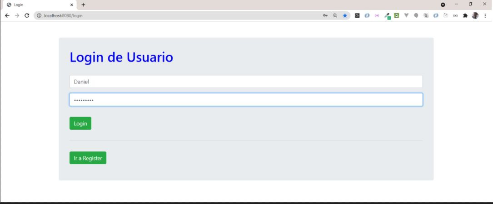
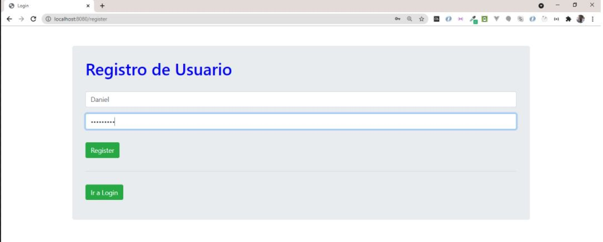
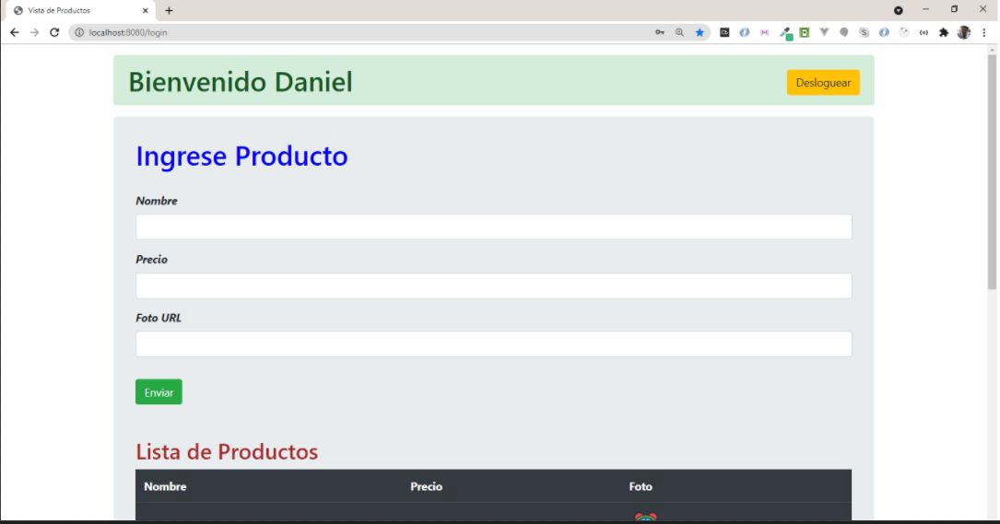

# INICIO DE SESIÓN

**Formato**: link a un repositorio en Github con el proyecto cargado.  
**Sugerencia**: no incluir los node_modules

## Consigna:

Implementar sobre el entregable que venimos realizando un mecanismo de autenticación. Para ello:

- Se incluirá una vista de registro, en donde se pidan email y contraseña. Estos datos se persistirán usando MongoDb, en una (nueva) colección de usuarios, cuidando que la contraseña quede encriptada (sugerencia: usar la librería bcrypt).

- Una vista de login, donde se pida email y contraseña, y que realice la autenticación del lado del servidor a través de una estrategia de passport local.

- Cada una de las vistas (logueo - registro) deberá tener un botón para ser redirigido a la otra.

- Una vez logueado el usuario, se lo redirigirá al inicio, el cual ahora mostrará también su email, y un botón para desolguearse.

- Además, se activará un espacio de sesión controlado por la sesión de passport. Esta estará activa por 10 minutos y en cada acceso se recargará este tiempo.

- Agregar también vistas de error para login (credenciales no válidas) y registro (usuario ya registrado).

- El resto de la funciones, deben quedar tal cual estaban el proyecto original.

## Ejemplos de vistas de acceso a continuación.

- Ejemplo 1

- Ejemplo 2

- Ejemplo 3

- Ejemplo 4

- Ejemplo 5

## Detalles del entregable:
La solución entregada deberá persistir las sesiones de usuario en Mongo Atlas.
- Verificar que en los reinicios del servidor, no se pierdan las sesiones activas de los clientes.
- Mediante el cliente web de Mongo Atlas, revisar los id de sesión correspondientes a cada cliente y sus datos.
- Borrar una sesión de cliente en la base y comprobar que en el próximo request al usuario se le presente la vista de login.
- Fijar un tiempo de expiración de sesión de 10 minutos recargable con cada visita del cliente al sitio y verificar que si pasa ese tiempo de inactividad el cliente quede deslogueado.
